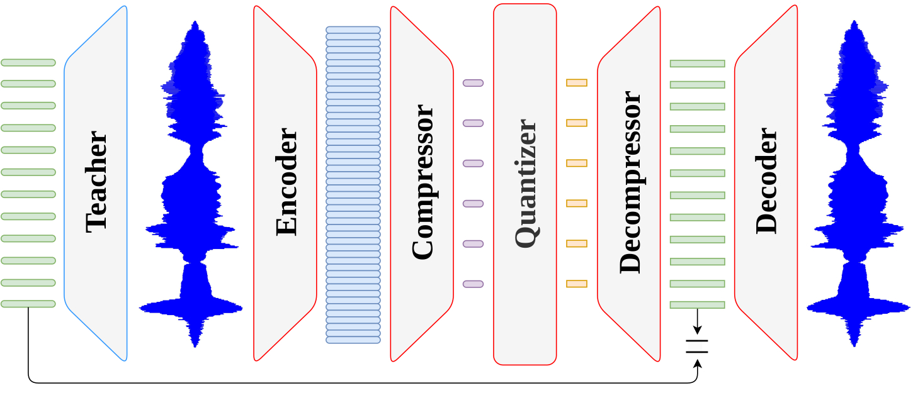

# 🗜️ ZipCodec

[](LICENSE)
[](https://github.com/lucadellalib/zipcodec)
[](https://www.python.org/)

A 6.25 Hz, 0.80 kbit/s streaming neural audio codec based on [WavLM](https://arxiv.org/abs/2110.13900).

- 📜 **Paper**: https://arxiv.org/abs/2609.11642

- 🌐 **Project Page**: https://lucadellalib.github.io/zipcodec-web/

- 🔊 **Downstream Tasks**: https://github.com/lucadellalib/audiocodecs



---------------------------------------------------------------------------------------------------------

## 🛠️ Installation

ZipCodec requires [Python 3.10 or later](https://www.python.org/).

### Minimal Torch Hub Installation

To use the pretrained codec through PyTorch Hub, create a virtual environment
and install only its runtime dependencies:

```bash
python -m venv .venv
source .venv/bin/activate  # Windows: .venv\Scripts\activate
pip install torch huggingface-hub numpy safetensors
```

No repository clone or local ZipCodec installation is required. PyTorch Hub
downloads and caches the implementation and checkpoint automatically:

```python
import torch

codec = torch.hub.load(
    "lucadellalib/zipcodec",
    "zipcodec",
    config="lucadellalib/zipcodec",
    trust_repo=True,
).eval()
```

### Full Development Environment

To run the bundled examples or contribute to ZipCodec, clone the repository and
install its complete locked environment with
[uv](https://docs.astral.sh/uv/):

**macOS and Linux**

```bash
curl -LsSf https://astral.sh/uv/install.sh | sh
```

**Windows PowerShell**

```powershell
powershell -ExecutionPolicy ByPass -c "irm https://astral.sh/uv/install.ps1 | iex"
```

Alternatively, install `uv` with `pipx`:

```bash
pipx install uv
```

Confirm that the command is available:

```bash
uv --version
```

Clone the repository, install Python 3.10, and create the environment with that
exact interpreter and the locked dependencies:

```bash
git clone https://github.com/lucadellalib/zipcodec.git
cd zipcodec
uv python install 3.10
uv sync --python 3.10
```

Run commands inside that environment with `uv run`:

```bash
uv run python -c "import zipcodec; print(zipcodec.__version__)"
```

The core package depends only on Hugging Face Hub, NumPy, safetensors, and
PyTorch. Optional features can be installed independently:

```bash
pip install "zipcodec[onnx]"       # ONNX export and CPU inference
pip install "zipcodec[openvino]"   # ONNX export and OpenVINO inference
pip install "zipcodec[streaming]"  # Microphone input and audio playback
```

Extras can be combined when their ONNX Runtime distributions do not conflict,
for example `pip install "zipcodec[onnx,streaming]"`. GPU users should install
the core package with `onnx` and `onnxruntime-gpu` explicitly instead of using
the `onnx` extra:

```bash
pip install zipcodec onnx onnxruntime-gpu
```

The development environment remains the complete contributor setup and
provides the dependencies used by all ONNX, OpenVINO, microphone, and export
examples.

> **NOTE:** install only one ONNX Runtime distribution in a deployment
> environment: `onnxruntime`, `onnxruntime-gpu`, or
> `onnxruntime-openvino`. They expose the same `onnxruntime` Python module and
> can hide one another's execution providers.

---------------------------------------------------------------------------------------------------------

## ▶️ Quickstart

From the root of the cloned repository, load ZipCodec through PyTorch Hub and
resynthesize one of the bundled audio examples:

```python
import torch

device = torch.device("cuda" if torch.cuda.is_available() else "cpu")
codec = (
    torch.hub.load(
        "lucadellalib/zipcodec",
        "zipcodec",
        config="lucadellalib/zipcodec",
        trust_repo=True,
    )
    .eval()
    .to(device)
)

# Load and resample the input waveform to the codec sample rate
audio_file = "audios/english/251-118436-0003.wav"
wav, sample_rate = codec.load_audio(audio_file)
wav = codec.resample_audio(wav, sample_rate, codec.sample_rate_input)
wav = wav.to(device)

with torch.no_grad():
    # Encode the waveform into discrete tokens
    toks = codec.wav_to_toks(wav)
    print("tokens:", toks.shape)

    # Convert the tokens into continuous quantized codes
    codes = codec.toks_to_codes(toks)
    print("codes:", codes.shape)

    # Decode the tokens back into a waveform
    wav_rec = codec.toks_to_wav(toks)

# Restore the original sample rate and save the reconstruction
wav_rec = codec.resample_audio(wav_rec, codec.sample_rate_output, sample_rate)
codec.save_audio("outputs/reconstruction.wav", wav_rec, sample_rate)
```

---------------------------------------------------------------------------------------------------------

## 📌 Available Checkpoints

|                  Checkpoint                                           | Sample rate |  Frame rate | Codebooks |  Bitrate  | Streaming |
|:---------------------------------------------------------------------:|:-----------:|:-----------:|:---------:|:---------:|:---------:|
| [lucadellalib/zipcodec](https://huggingface.co/lucadellalib/zipcodec) |   16 kHz    |   6.25 Hz   |  64 × 4   | 0.80 kbps |    ✅      |

---------------------------------------------------------------------------------------------------------

## 🎤 Running the Examples

> **NOTE:** the `audios` directory contains sample speech files that can be
> used to experiment with offline and streaming resynthesis. See
> [sample audio attribution](audios/README.md) for their sources and licenses.

### Speech Resynthesis

💾 **Offline and streaming backend comparison**

```bash
uv run python examples/resynthesis.py
```

The default input is `audios/english/251-118436-0003.wav`. Use `--audio` to
select another file. Results are written to:

```text
outputs/resynthesis/
├── offline/
└── streaming/
```

Disable individual deployment paths with `--skip-compile`, `--skip-jit`,
`--skip-cudagraph`, or `--skip-onnx`.

⚡ **Stream from an audio file on CPU**

```bash
uv run python examples/stream.py \
    --audio audios/english/251-118436-0003.wav
```

The default reconstructed file is `outputs/stream/eager_file.wav`.

🎤 **Stream from the microphone**

```bash
uv run python examples/stream.py \
    --microphone \
    --duration 0
```

Use `Ctrl+C` to stop. The reconstructed microphone signal is written to
`outputs/stream/eager_microphone.wav`.

🚀 **Use another CPU backend**

```bash
uv run python examples/stream.py \
    --backend jit \
    --audio audios/english/251-118436-0003.wav
```

Available streaming demo backends are `eager`, `compile`, `jit`, and
`openvino`. For OpenVINO:

```bash
uv run python examples/stream.py \
    --backend openvino \
    --audio audios/english/251-118436-0003.wav
```

The demo defaults to four PyTorch intra-op threads and one inter-op thread.
Tune the intra-op count for your CPU with `--threads`:

```bash
uv run python examples/stream.py \
    --microphone \
    --threads 4
```

### Voice Conversion

🎤 **Online voice conversion from the microphone**

Pass a directory of target-speaker WAV files:

```bash
uv run python examples/stream.py \
    --microphone \
    --duration 0 \
    --target-voice audios/english/84
```

⚡ **Voice conversion from an audio file**

```bash
uv run python examples/stream.py \
    --backend jit \
    --audio audios/english/p226_006.wav \
    --target-voice audios/english/84
```

Target directories are searched recursively for `.wav` files. ZipCodec uses
`lucadellalib/focalcodec_50hz` to construct a WavLM6 target feature pool.
Large pools consume more memory and increase nearest-neighbor matching time.

Use `--dtype fp16` to reduce the memory occupied by the models, streaming
state, and target pool:

```bash
uv run python examples/stream.py \
    --microphone \
    --target-voice audios/english/84 \
    --dtype fp16
```

### Understanding Streaming Metrics

The streaming demo reports:

- **Chunk latency**: inference time for one fixed-size chunk, including state
  preparation and the selected endpoint, but excluding audio input, playback,
  and file saving.
- **Steady-state RTF**: audio duration divided by summed inference time.
- **End-to-end RTF**: audio duration divided by total loop wall time.
- **Input overflows / output underflows**: sound-device status events during
  microphone operation.

For reliable real-time operation, p99 chunk latency should remain below the
printed chunk duration, ideally with enough margin for operating-system and
audio-device scheduling.

---------------------------------------------------------------------------------------------------------

## 🧠 Advanced Usage

### Package and Local Loading

After installing the package, load the checkpoint through the Python API:

```python
import torch

from zipcodec import ZipCodec

device = torch.device("cuda" if torch.cuda.is_available() else "cpu")
codec = ZipCodec.from_pretrained("lucadellalib/zipcodec").eval().to(device)
```

A local configuration and its adjacent checkpoint use the same interface:

```python
codec = ZipCodec.from_pretrained("checkpoints/zipcodec").eval().to(device)
```

Inspect the loaded model and its streaming configuration with:

```python
print(codec.info())
```

### Dependency-Free Audio I/O

ZipCodec can load, save, and resample WAV audio without `torchaudio`,
`soundfile`, or other audio dependencies, as shown in the quickstart above.

`load_audio` supports 8-, 16-, 24-, and 32-bit integer PCM plus 32-bit
floating-point WAV files and returns `(waveform, sample_rate)`, with the
waveform shaped `(channels, time)`.
`save_audio` writes 32-bit floating-point WAV files by default; pass
`encoding="pcm16"` to write 16-bit PCM instead. `resample_audio` operates along
the last tensor axis using Hann-windowed sinc interpolation and preserves the
input device and floating-point dtype.

### Standard, Step, and Step-Desync Methods

ZipCodec provides three execution forms for transforms that contain streaming
components:

| Form              | Purpose                                      | State | Additional input |
|:------------------|:---------------------------------------------|:-----:|:-----------------|
| **Standard**      | Process a complete synchronized input        |   ❌   | —                |
| **`step`**        | Advance every stream by one fixed-size chunk |   ✅   | —                |
| **`step_desync`** | Advance only selected batch slots            |   ✅   | `exec_mask`      |

The standard methods are convenient for complete utterances. A `step` method
retains causal history between chunks through a flat state tuple.
`step_desync` is intended for continuous batching: `exec_mask[b] = False`
preserves slot `b`'s state while other slots continue.

The method and endpoint families are:

| Transform                                             | Standard                 | Synchronized streaming        | Desynchronized streaming             |
|:------------------------------------------------------|:-------------------------|:------------------------------|:-------------------------------------|
| Waveform → waveform                                   | `forward`                | `step`                        | `step_desync`                        |
| Waveform → frame features                             | `wav_to_frame_feats`     | `wav_to_frame_feats_step`     | `wav_to_frame_feats_step_desync`     |
| Waveform → 6.25 Hz features                           | `wav_to_feats`           | `wav_to_feats_step`           | `wav_to_feats_step_desync`           |
| Waveform → latents                                    | `wav_to_lats`            | `wav_to_lats_step`            | `wav_to_lats_step_desync`            |
| Waveform → tokens                                     | `wav_to_toks`            | `wav_to_toks_step`            | `wav_to_toks_step_desync`            |
| Waveform → 6.25 Hz quantized features                 | `wav_to_qfeats`          | `wav_to_qfeats_step`          | `wav_to_qfeats_step_desync`          |
| Waveform → frame quantized features                   | `wav_to_frame_qfeats`    | `wav_to_frame_qfeats_step`    | `wav_to_frame_qfeats_step_desync`    |
| Waveform → converted waveform                         | `wav_to_wav_vc`          | `wav_to_wav_vc_step`          | `wav_to_wav_vc_step_desync`          |
| 6.25 Hz features → latents                            | `feats_to_lats`          | `feats_to_lats_step`          | `feats_to_lats_step_desync`          |
| 6.25 Hz features → tokens                             | `feats_to_toks`          | `feats_to_toks_step`          | `feats_to_toks_step_desync`          |
| 6.25 Hz features → quantized features                 | `feats_to_qfeats`        | `feats_to_qfeats_step`        | `feats_to_qfeats_step_desync`        |
| Latents → tokens                                      | `lats_to_toks`           | —                             | —                                    |
| Latents → codes                                       | `lats_to_codes`          | —                             | —                                    |
| Latents → quantized features                          | `lats_to_qfeats`         | `lats_to_qfeats_step`         | `lats_to_qfeats_step_desync`         |
| Latents → waveform                                    | `lats_to_wav`            | `lats_to_wav_step`            | `lats_to_wav_step_desync`            |
| Tokens → codes                                        | `toks_to_codes`          | —                             | —                                    |
| Codes → tokens                                        | `codes_to_toks`          | —                             | —                                    |
| Tokens → 6.25 Hz quantized features                   | `toks_to_qfeats`         | `toks_to_qfeats_step`         | `toks_to_qfeats_step_desync`         |
| Tokens → frame quantized features                     | `toks_to_frame_qfeats`   | `toks_to_frame_qfeats_step`   | `toks_to_frame_qfeats_step_desync`   |
| Tokens → waveform                                     | `toks_to_wav`            | `toks_to_wav_step`            | `toks_to_wav_step_desync`            |
| Tokens → converted waveform                           | `toks_to_wav_vc`         | `toks_to_wav_vc_step`         | `toks_to_wav_vc_step_desync`         |
| Codes → 6.25 Hz quantized features                    | `codes_to_qfeats`        | `codes_to_qfeats_step`        | `codes_to_qfeats_step_desync`        |
| Codes → frame quantized features                      | `codes_to_frame_qfeats`  | `codes_to_frame_qfeats_step`  | `codes_to_frame_qfeats_step_desync`  |
| 6.25 Hz quantized features → frame quantized features | `qfeats_to_frame_qfeats` | `qfeats_to_frame_qfeats_step` | `qfeats_to_frame_qfeats_step_desync` |
| 6.25 Hz quantized features → waveform                 | `qfeats_to_wav`          | `qfeats_to_wav_step`          | `qfeats_to_wav_step_desync`          |
| Frame quantized features → waveform                   | `frame_qfeats_to_wav`    | `frame_qfeats_to_wav_step`    | `frame_qfeats_to_wav_step_desync`    |

`feats` and `qfeats` refer to the continuous 6.25 Hz representations before
the compressor and before unpatching, respectively. `frame_feats` are the
frame-rate log-mel features, while `frame_qfeats` are the quantized features
after unpatching. Frame-level kNN voice conversion operates on
`frame_qfeats`.

`lats_to_toks`, `lats_to_codes`, `toks_to_codes`, `codes_to_toks`, and `knn`
are stateless operations, so they only need their standard form.
`codes_to_toks` requantizes continuous codes; it is not an exact inverse of
`toks_to_codes` and need not reproduce the original tokens.

Every registered form is also a named dictionary endpoint with stable semantic
inputs and outputs. For example:

```python
endpoint = codec.eager("wav_to_toks")

with torch.no_grad():
    outputs = endpoint({"wav": wav})
    toks = outputs["toks"]
```

Streaming endpoints add `state` to their inputs and `next_state` to their
outputs. Desynchronized endpoints additionally take a Boolean `exec_mask`:

```python
endpoint_name = "step_desync"
endpoint = codec.eager(endpoint_name)
chunk = wav[:, : codec.chunk_size]
state = codec.init_endpoint_state(
    endpoint_name,
    batch_size=chunk.shape[0],
    device=chunk.device,
    dtype=chunk.dtype,
)
exec_mask = torch.ones(chunk.shape[0], device=chunk.device, dtype=torch.bool)

with torch.no_grad():
    outputs = endpoint(
        {
            "wav": chunk,
            "state": state,
            "exec_mask": exec_mask,
        }
    )
    wav_rec = outputs["wav_rec"]
    state = outputs["next_state"]
```

Inspect any endpoint and the codec components it requires:

```python
spec = codec.endpoint_spec("wav_to_toks_step")
components = codec.components_for_endpoint("wav_to_toks_step")
```

---------------------------------------------------------------------------------------------------------

### Stateful Streaming

Streaming endpoints receive a tuple of state tensors and return the state for
the next chunk:

```python
endpoint_name = "step"
endpoint = codec.eager(endpoint_name)
state = codec.init_endpoint_state(
    endpoint_name,
    batch_size=wav.shape[0],
    device=wav.device,
    dtype=wav.dtype,
)
chunk_size = codec.chunk_size

chunks = []
with torch.no_grad():
    for offset in range(0, wav.shape[1], chunk_size):
        chunk = wav[:, offset : offset + chunk_size]
        if chunk.shape[1] < chunk_size:
            chunk = torch.nn.functional.pad(
                chunk,
                (0, chunk_size - chunk.shape[1]),
            )
        outputs = endpoint({"wav": chunk, "state": state})
        chunks.append(outputs["wav_rec"])
        state = outputs["next_state"]

wav_rec = torch.cat(chunks, dim=1)[:, : wav.shape[1]]
```

`step`, `wav_to_lats_step`, and `wav_to_toks_step` consume one frontend chunk.
Other step endpoints validate the frame size expected by their first component.

---------------------------------------------------------------------------------------------------------

### Endpoint Backends

Choose a backend without changing the endpoint's dictionary input/output
contract:

| Backend         | Constructor                             | Offline endpoints | Fixed-size streaming endpoints |
|:----------------|:----------------------------------------|:-----------------:|:------------------------------:|
| Eager PyTorch   | `codec.eager(name)`                     |         ✅         |               ✅               |
| `torch.compile` | `codec.compile(name)`                   |         ✅         |               ✅               |
| TorchScript     | `codec.jit(name, example_inputs)`       |         ❌         |               ✅               |
| CUDA Graph      | `codec.cudagraph(name, example_inputs)` |         ❌         |               ✅               |
| ONNX Runtime    | `codec.onnx(name, example_inputs, ...)` |         ❌         |               ✅               |

`example_inputs` is a dictionary containing one representative invocation of
the endpoint. Its keys must match the endpoint inputs, while tensor shapes,
dtypes, and devices must match the intended deployment configuration. For the
full-codec `step` endpoint:

```python
state = codec.init_endpoint_state(
    "step",
    batch_size=1,
    device=device,
    dtype=torch.float32,
)
example_inputs = {
    "wav": torch.zeros(1, codec.chunk_size, device=device),
    "state": state,
}
```

The same dictionary is used to call eager and compiled endpoints:

```python
eager_endpoint = codec.eager("step")
compiled_endpoint = codec.compile("step")

eager_outputs = eager_endpoint(example_inputs)
compiled_outputs = compiled_endpoint(example_inputs)
```

TorchScript, CUDA Graph, and ONNX use `example_inputs` to trace or export the
fixed-size streaming graph.

#### PyTorch Backends

```python
compiled = codec.compile("step")
traced = codec.jit("step", example_inputs)
cuda_graph = codec.cudagraph("step", example_inputs)

outputs = compiled(example_inputs)
```

CUDA Graph requires the codec and every input tensor to reside on CUDA.

#### ONNX Runtime

```python
onnx_endpoint = codec.onnx(
    "step",
    example_inputs,
    providers=("CPUExecutionProvider",),
)
outputs = onnx_endpoint(example_inputs)
```

For CUDA tensors, enable I/O binding to avoid routing tensors through CPU NumPy
arrays:

```python
onnx_endpoint = codec.onnx(
    "step",
    example_inputs,
    providers=("CUDAExecutionProvider",),
    io_binding=True,
    output_device=torch.device("cuda"),
)
```

To persist a standalone deployment artifact:

```bash
uv run python examples/export_onnx.py
```

By default, this exports the `step` endpoint to
`outputs/onnx/zipcodec_step.onnx`. The equivalent Python API is:

```python
model_path, metadata_path, inputs_path = codec.export_onnx(
    "step",
    example_inputs,
    "outputs/onnx/zipcodec_step.onnx",
)
```

This writes:

- `zipcodec_step.onnx`: the ONNX graph
- `zipcodec_step.onnx.data`: consolidated external model weights
- `zipcodec_step.json`: I/O metadata, state mapping, and artifact SHA-256 checksums
- `zipcodec_step_inputs.npz`: example NumPy inputs, including initial state

Export FP16 weights and inputs to reduce the deployment size by approximately
half:

```bash
uv run python examples/export_onnx.py --dtype fp16
```

FP16 export uses ONNX Runtime's conversion tools, which are included in the
development environment installed by `uv sync --group dev`. FP16 inference is
primarily intended for GPU execution providers; use FP32 for the broadest CPU
compatibility and numerical stability.

The model can then run in an environment containing only NumPy and the
appropriate ONNX Runtime distribution:

```bash
pip install numpy onnxruntime
python examples/run_onnx.py \
    outputs/onnx/zipcodec_step.onnx \
    audios/english/251-118436-0003.wav \
    --verify-checksums \
    --output outputs/onnx/reconstruction.wav
```

The model and audio arguments shown above are the defaults, so after exporting
the checkpoint the same example can be run with `python examples/run_onnx.py`.

`examples/run_onnx.py` loads mono 16-bit PCM or 32-bit float WAV audio,
resamples it to 16 kHz when necessary, streams every chunk through ONNX Runtime,
and saves the complete reconstruction. `--verify-checksums` validates the graph,
weights, and initial inputs before loading them. The runner does not import
PyTorch or ZipCodec. FP32 export requires PyTorch and ONNX; FP16 export also
requires ONNX Runtime's conversion tools. Deployment needs only the `.onnx`
file, its accompanying `.onnx.data` file and input-state archive, NumPy, and the
selected ONNX Runtime distribution.

---------------------------------------------------------------------------------------------------------

### Endpoint-Driven Selective Loading

Load only the modules needed by one endpoint:

```python
codec = ZipCodec.from_pretrained(
    "lucadellalib/zipcodec",
    endpoint="wav_to_toks",
).eval()
```

The same option is available when loading through PyTorch Hub:

```python
codec = torch.hub.load(
    "lucadellalib/zipcodec",
    "zipcodec",
    config="lucadellalib/zipcodec",
    endpoint="wav_to_toks_step",
    trust_repo=True,
).eval()
```

Or choose components explicitly:

```python
codec = ZipCodec.from_pretrained(
    "lucadellalib/zipcodec",
    components=(
        "encoder",
        "frontend",
        "compressor",
        "quantizer",
    ),
).eval()
```

Remote loading still caches the complete safetensors checkpoint, but only the
selected tensors are loaded into memory. To remove unused modules from an
already loaded instance:

```python
codec.prune_for_endpoint("wav_to_toks")
```

Pruning mutates the codec instance. Reload the model to recover discarded
components.

---------------------------------------------------------------------------------------------------------

## 📊 Benchmark

Compare streaming backends:

```bash
uv run python examples/benchmark.py \
    --backends eager compile jit cudagraph onnx onnx-iobinding openvino
```

Select a device and dtype:

```bash
uv run python examples/benchmark.py --device cuda --dtype fp16
uv run python examples/benchmark.py --device cpu --dtype bf16
```

The table includes model size, peak PyTorch CUDA allocation, timing statistics,
and real-time factor. It is printed to the terminal and saved to
`outputs/benchmark.txt`. Use `--output` to select a different report path.

### Continuous Batching

Run the desynchronized `step_desync` example:

```bash
uv run python examples/continuous_batching.py --batch-size 2
```

Each persistent slot can start, pause, resume, and finish independently through
an `exec_mask`. Reconstructions are saved under
`outputs/continuous_batching/`.

### Streaming Profiling

Profile the full eager streaming `step` endpoint on CPU and GPU:

```bash
uv run python examples/profile_streaming.py
```

By default, the script benchmarks CPU batch size 1 and GPU batch sizes 1, 2, 4,
8, and 16 in FP32. Each row uses five runs of 40.96 seconds with four CPU
threads. The table reports real-time factor, mean and p99 step latency,
throughput, and peak PyTorch-reserved GPU VRAM. Results are printed to the
terminal and saved to `outputs/profile_streaming.txt`.

Use command-line options to change the dtype, number of runs, GPU batch sizes,
or output path:

```bash
uv run python examples/profile_streaming.py \
    --dtype fp16 \
    --runs 5 \
    --gpu-batch-sizes 1 2 4 8 16
```

---------------------------------------------------------------------------------------------------------

## 🧩 Custom Endpoints

Register a codec method with stable semantic names:

```python
from types import MethodType


def wav_to_toks_codes(self, wav):
    toks = self.wav_to_toks(wav)
    return toks, self.toks_to_codes(toks)


codec.wav_to_toks_codes = MethodType(wav_to_toks_codes, codec)
codec.register_endpoint(
    "wav_to_toks_codes",
    "wav",
    ("toks", "codes"),
    ("encoder", "frontend", "compressor", "quantizer"),
)

outputs = codec.eager("wav_to_toks_codes")({"wav": wav})
```

Registration applies to one codec instance. Pass `replace=True` to replace an
existing endpoint.

---------------------------------------------------------------------------------------------------------

## @ Citing

```bibtex
@article{dellalibera2026zipcodec,
    title   = {{ZipCodec}: Ultra-Low-Frame-Rate Streaming Speech Coding},
    author  = {Luca {Della Libera} and Cem Subakan and Mirco Ravanelli},
    journal = {arXiv preprint arXiv:2609.11642},
    year    = {2026},
}
```

---------------------------------------------------------------------------------------------------------

## 📧 Contact

[luca.dellalib@gmail.com](mailto:luca.dellalib@gmail.com)

---------------------------------------------------------------------------------------------------------
